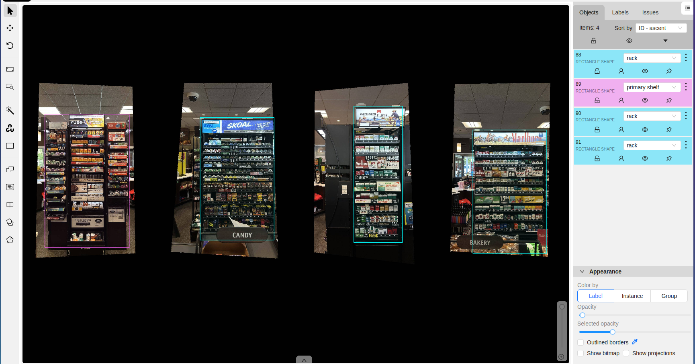
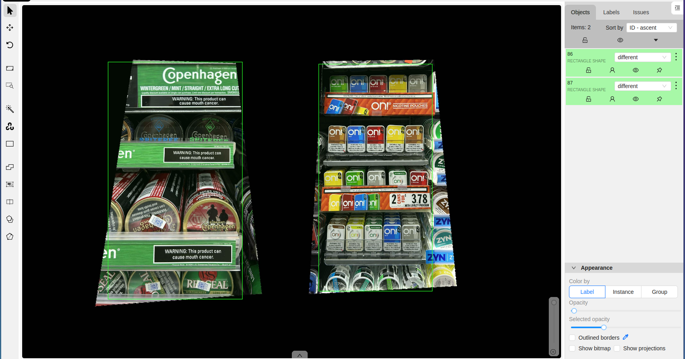
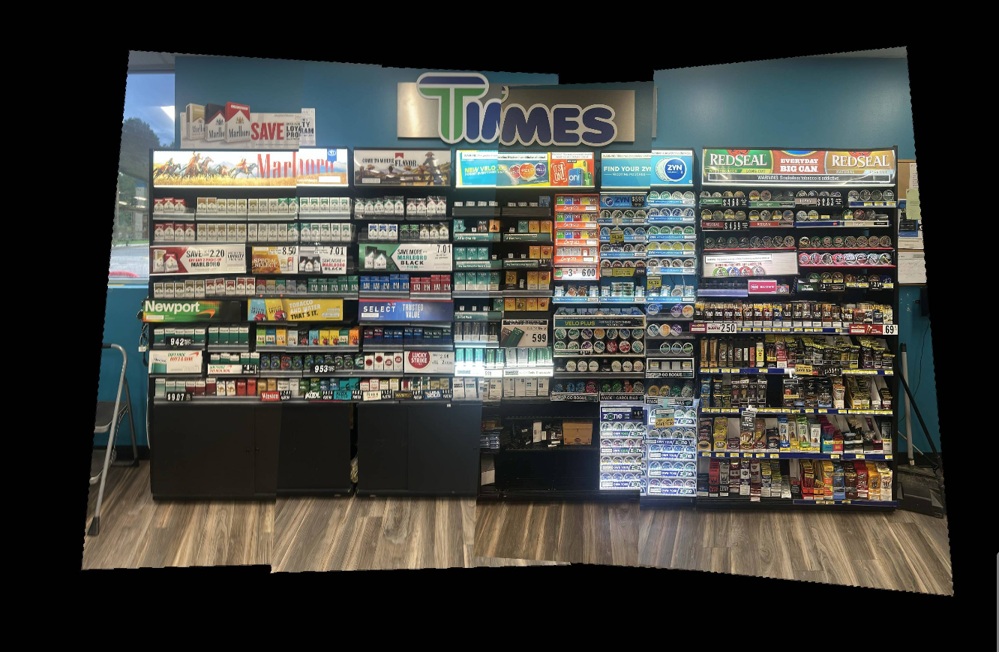
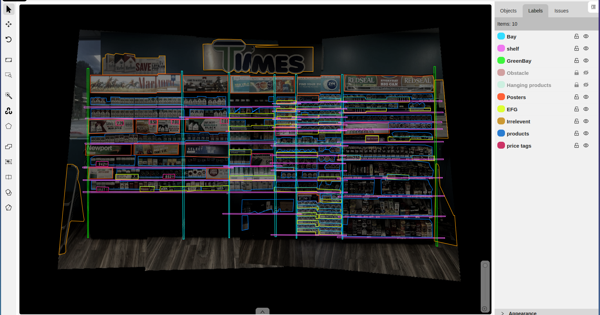
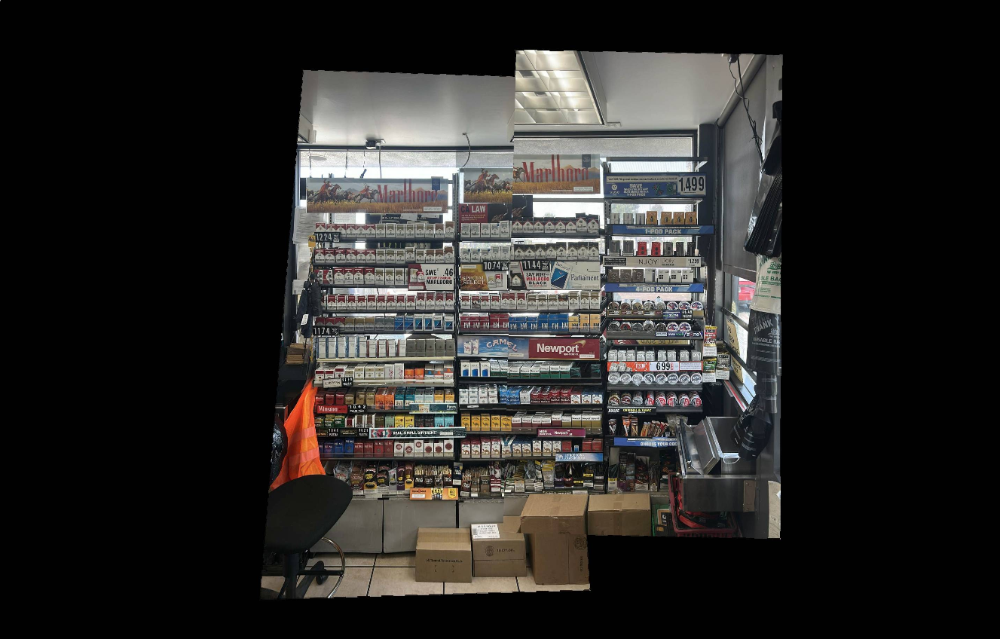

# 🗂️ Dataset Labeling Demo – Retail Shelves

This project demonstrates how to create and export labeled datasets for computer vision tasks using **CVAT**.
I annotated a set of retail shelf images and exported them into **YOLOv8** and **COCO** formats.

---

## 📌 Project Overview
- **Task:** Object detection dataset creation
- **Tool:** [CVAT](https://cvat.ai/)
- **Images Labeled:** 350+ retail shelf screenshots
- **Classes:**
  - `rack`
  - `primary shelf`
  - `different`

---

## 🛠️ Workflow
1. Imported raw retail shelf images into CVAT.
2. Labeled bounding boxes for `rack`, `primary shelf`, and `different`.
3. Exported dataset in two formats: **YOLOv8** + **COCO JSON**.
4. Validated exports by loading into **Ultralytics YOLOv8**.

---

## 📂 Repo Structure
- /images        → Sample raw images
- /labels        → CVAT project files
- /exports/annotations_yolo/ → YOLO format annotations (.txt)
- /exports/annotations_coco/ → COCO format annotations (.json)
---     
### Example Labeled Images
Below are a few screenshots of the annotations created in CVAT:

---
## 🎨 Pixel-Perfect Segmentation

In addition to bounding boxes, I also performed **pixel-accurate polygon segmentation** of retail racks.
This provides much higher quality annotations compared to simple bounding boxes.

### Why Segmentation?
- Bounding boxes = rough outlines
- Segmentation = exact object boundaries
- Used in **self-driving cars, medical imaging, retail shelf analysis**

### Example
Below is an example of a rack annotated with segmentation in CVAT:

| Original Image | Segmentation Mask |
|----------------|-------------------|
|  |  |
|  |  |

Segmentation was exported in **CVAT for images 1.1** (`segmentation` field), making it directly usable for training instance segmentation models (e.g., Mask R-CNN, YOLOv8-seg).

---
## 🚀 Why This Project?
Creating datasets is a **core skill** in ML/AI workflows.
This demo shows:
- Using professional annotation tools (CVAT).
- Exporting in multiple formats for flexibility.
- Preparing datasets that can directly train models (e.g., YOLOv8).
---
## 🔮 Next Steps
- Add **video annotation demo** (multi-frame bounding boxes).
- Try **Label Studio** for audio/text labeling.
- Scale up to **1000+ labeled images** for production training.

---

## 📧 Contact
If you’re interested in dataset creation, annotation, or model training collaborations, feel free to connect.
